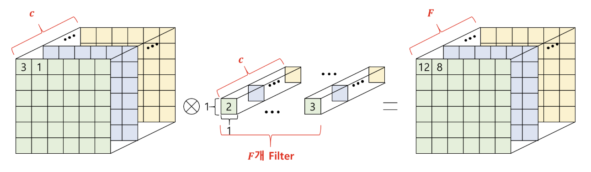
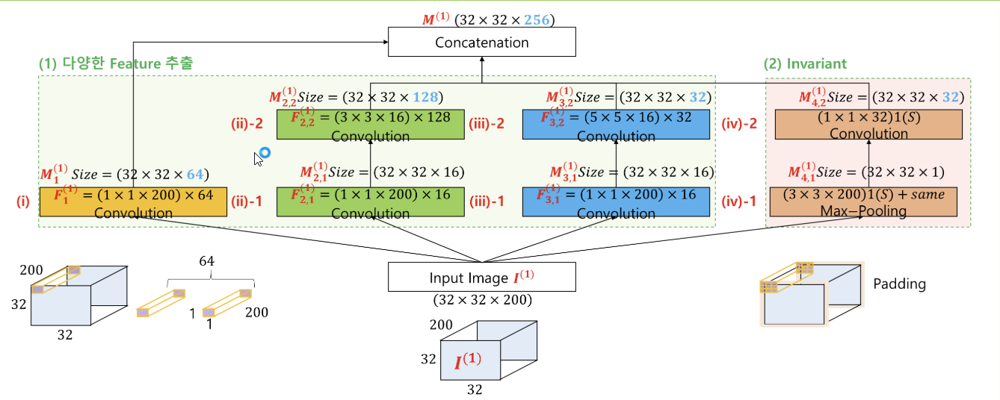
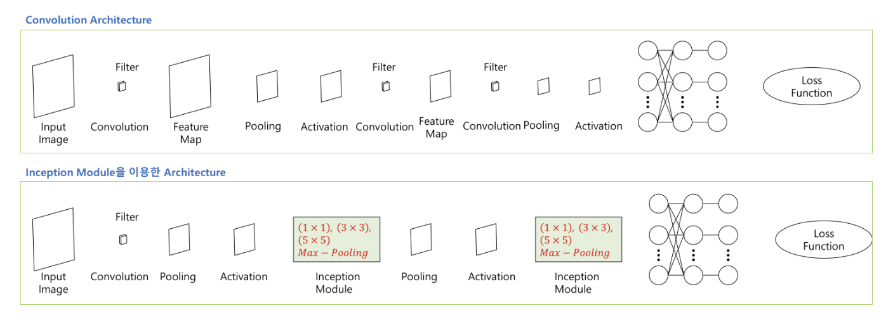

# 1x1 Convolution

1. **필터 구성**  
   - **1x1xC 필터**  
     입력 이미지의 각 위치에서 1x1 크기의 필터를 적용하며, 필터의 깊이는 입력 채널 수(C)와 같음  
     예를 들어 (1x1xC) 필터를 F개의 필터와 곱하면 출력 채널 수는 F가 됨

2. **공간적 크기 유지 및 채널 조절**  
   - **공간적 변화 없음**  
     1x1 convolution은 입력 이미지의 행과 열 크기를 변경하지 않으면서 채널 수(C)를 F로 조절할 수 있음  
   - **차원 축소 또는 확장**  
     - 차원 축소: 채널 수를 줄여 계산량을 감소시킴  
     - 차원 증가: 채널 수를 늘려 보다 다양한 특성 조합을 학습하고, 더 복잡한 패턴을 인식할 수 있도록 함

3. **장점**  
   - **파라미터 감소 및 계산 효율성 증가**  
     불필요한 파라미터 수를 줄이면서도 네트워크의 표현력을 유지하거나 향상시킬 수 있음  
   - **비선형성 추가**  
     보통 activation function(ReLU 등)과 함께 사용되어 네트워크에 비선형성을 추가하고 표현력을 향상시킴

---

# Inception Module

Inception Module은 다양한 크기의 필터를 병렬로 사용해 공간적 및 채널 간 상관관계를 독립적으로 살펴보며, 풍부한 특징(feature)을 추출할 수 있는 구조임

1. **구성 요소**  
   - **1x1 Convolution**  
     차원 축소 및 비선형성 추가를 위한 기본 블록임  
   - **3x3 Convolution**  
     중간 크기의 공간적 특징을 추출함  
   - **5x5 Convolution**  
     더 넓은 영역의 공간적 특징을 캡처함  
   - **3x3 Max-Pooling**  
     입력 이미지에서 강한 특징을 보존하면서 노이즈 제거나 차원 축소를 수행함

2. **특징 및 장점**  
   - **병렬 처리**  
     위의 4가지 과정을 동시에 병렬로 처리해 각기 다른 스케일의 특징을 동시에 학습할 수 있음  
   - **다양한 특징 추출**  
     여러 사이즈의 필터를 활용해 다양한 공간적(spatial) 및 채널 간(cross-channel) 상관관계를 독립적으로 살펴보고 풍부한 특징을 추출함  
   - **효율적인 네트워크 구성**  
     네트워크의 깊이를 지나치게 깊게 만들지 않으면서도 효과적인 특징 표현과 학습이 가능함

## The difference between Convolution and Inception

