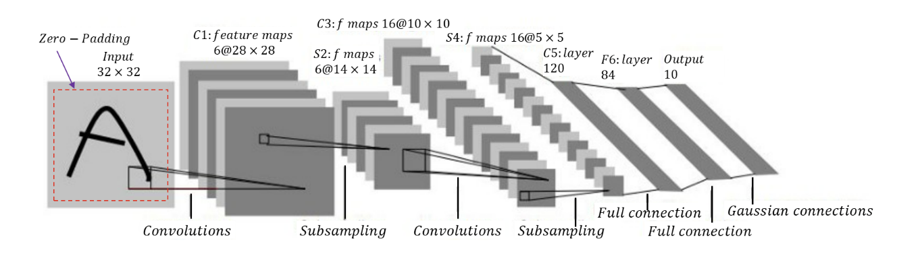
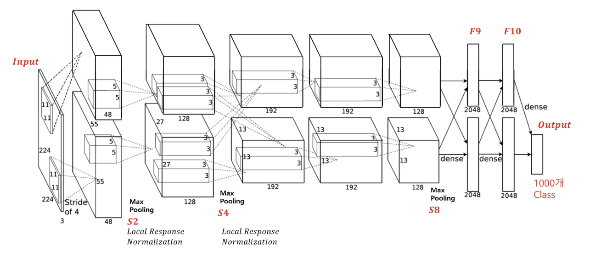
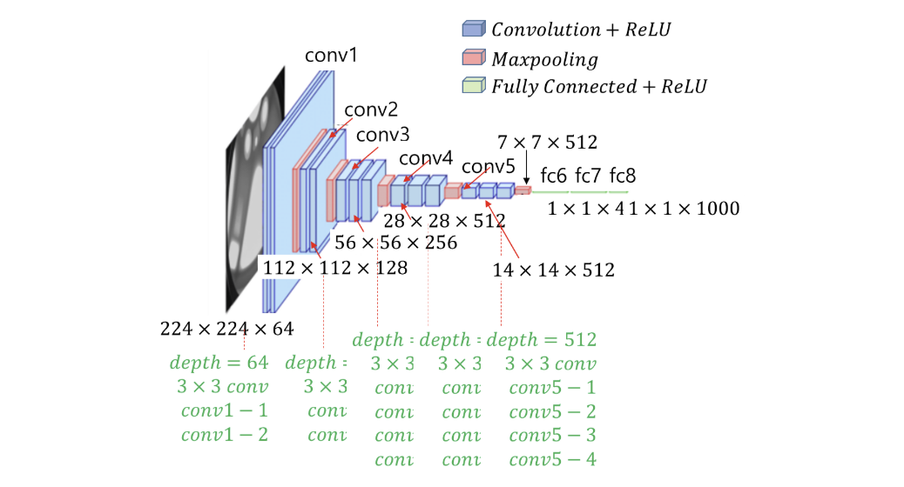

## 1. CNN의 기본 원리

- **픽셀 단위 처리**
  - 이웃(neighborhood) 픽셀들을 관심 픽셀과 동시에 고려하여 처리

- **CNN을 사용하는 이유**
  1. **공간적 위상 관계 보존**  
     - 이미지의 구조적 정보를 유지하여 위상 관계를 망가뜨리지 않음
  2. **모델 용량 감소**  
     - FCNN(Fully Connected Neural Network)보다 낮은 모델 용량으로 과적합 방지
  3. **특징 보존**  
     - 오브젝트의 특징이 보존되는 한, 동일 오브젝트로 인식 가능

---

## 2. 합성곱(Convolution) 연산

- **내적(Inner Product)를 통한 유사도 평가**
  - 이미지의 픽셀과 필터를 1차원 벡터화한 후 내적을 수행하여 두 벡터(이미지, 필터)의 유사도 측정

- **Parameter Sharing**
  - FCNN과 달리 동일 필터를 공유하여 모델 용량 감소 및 계산량 절감

- **관련 개념**
  - **Padding:** 이미지의 경계를 보존하기 위해 추가하는 0 또는 다른 값
  - **Stride:** 필터가 이동하는 간격
  - **Pooling:** 주요 특징을 축소하여 공간적 크기를 줄이고, 잡음을 제거하는 역할

---

## 3. 국부 수용 영역 (Receptive Field)

- **개념**
  - 개별 오브젝트의 여러 특징(예: 꼬리, 귀, 몸, 다리 등)을 모아 하나의 오브젝트(예: 강아지) 인식

- **CNN에서의 역할**
  - 작은 영역의 정보를 종합하여 전체 오브젝트를 인식

---

## 4. CNN을 활용한 작업

- **Regression:** 좌표값 찾기 (예: 오브젝트의 위치)
- **Classification:** 클래스 분류 (예: 오브젝트의 종류)

---

## 5. CNN의 가정

1. **Locality (공간적 국소성)**
   - 한 이미지 내에서 상호작용이 없는 두 물체는 서로 독립적으로 작용

2. **Stationarity**
   - 한 이미지 내 동일 오브젝트의 통계적 특성은 동일하므로 같은 파라미터(필터)를 사용할 수 있음

---

## 6. Convolution의 특징

- **Parameter Sharing**  
  하나의 필터가 이미지 전체에 동일하게 적용되어, 학습해야 하는 파라미터 수가 크게 줄어듭니다. 이는 모델의 복잡도를 낮추고 계산 효율을 높이는 역할을 합니다.

- **Sparse Interaction**  
  필터가 작은 영역(국부 영역)만 처리하므로, 한 번의 연산에서 전체 이미지가 아닌 일부 픽셀만 고려합니다. 이로 인해 계산량이 줄어들고 효율적으로 지역 정보를 추출할 수 있습니다.

- **Statistical Efficiency (연산 효율 증가)**  
  파라미터 공유와 국부적 연결 덕분에, 모델이 적은 데이터로도 일반화할 수 있도록 도와주며, 학습 과정에서 연산 비용이 줄어듭니다.

- **Translation Equivalence (input이 바뀌면 output도 바뀜)**  
  이미지 내에서 동일한 패턴이 다른 위치에 있을 때, 동일한 필터가 적용되어 이를 인식합니다. 즉, 이미지가 이동해도 주요 특징은 잘 포착되어 출력에 반영됩니다.

---

## 7. Pooling의 특징

- **Statistical Efficiency**  
  중요한 특징을 추출하고, 불필요한 세부 정보를 줄임으로써 모델의 계산 효율과 학습 속도를 높여줍니다.

- **Translation Invariance (pooling으로 이미지를 조작해도 특징은 유지)**  
  pooling 연산은 작은 위치 변화에도 불구하고 동일한 주요 특징을 유지하게 하여, 이미지 내 객체가 약간 이동하더라도 동일하게 인식됩니다.

- **Scale Invariance (크기의 영향 X)**  
  pooling을 통해 이미지의 크기나 해상도가 달라져도, 주요 특징은 크게 변화하지 않기 때문에 다양한 크기의 객체를 효과적으로 처리할 수 있습니다.

---

## 8. Object Detection

- **정의**
  - 좌표 찾기와 클래스 분류를 동시에 수행

---

## 9. 주요 네트워크 구조

### 9.1 LeNet
- **목적:** MNIST 숫자 인식을 위해 개발

- **구성:**
  - 입력 이미지 (Zero-padding)
  - Convolution → Subsampling → Convolution → Subsampling → FCN

### 9.2 AlexNet
- **특징:**
  - 필터 크기를 점차 줄이며 큰 특징부터 작은 특징까지 인식

  - **ReLU 도입:** 활성화 함수로 ReLU를 최초 도입
  - **Dropout:** 과적합 방지 기법
  - **Data Augmentation:** 데이터 증강 기법 활용
    - **Color Augmentation:** PCA를 통해 이미지의 RGB 값 이동 및 변경
  - **Overlapping Max-Pooling:** stride=1로 이미지 크기가 서서히 감소

### 9.3 VGGNet
- **주요 아이디어:** 네트워크 깊이에 따른 성능 향상 탐구

- **구성:**
  - **필터:** 3x3 필터만을 사용하여 깊이에 집중
  - **문제점:** 네트워크가 깊어짐에 따라 gradient vanishing 문제 발생 가능성

