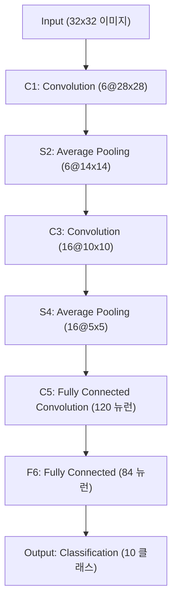

# LeNet-5 Architecture Flow

```mermaid
graph TD;
    A["Input (32x32 이미지)"] --> B["C1: Convolution (6@28x28)"];
    B --> C["S2: Average Pooling (6@14x14)"];
    C --> D["C3: Convolution (16@10x10)"];
    D --> E["S4: Average Pooling (16@5x5)"];
    E --> F["C5: Fully Connected Convolution (120 뉴런)"];
    F --> G["F6: Fully Connected (84 뉴런)"];
    G --> H["Output: Classification (10 클래스)"];
```