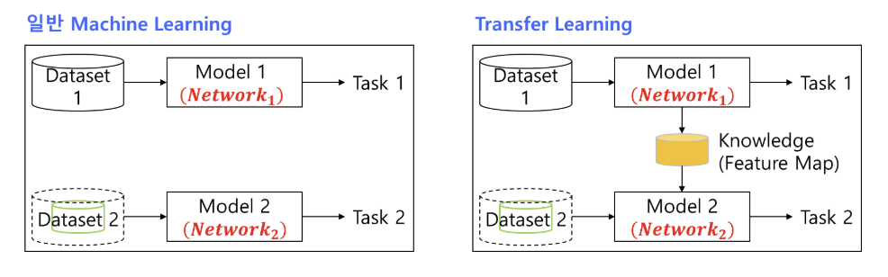
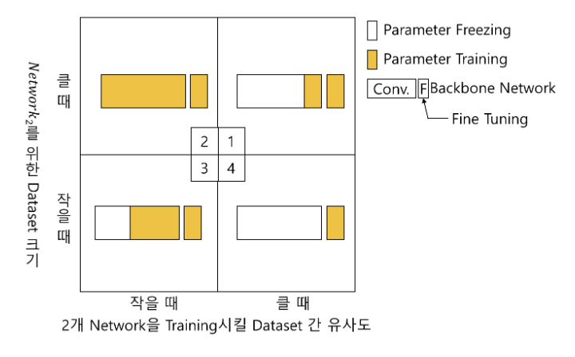

# Transfer Learning

- **Transfer Learning**(전이학습): 이미 학습된 모델(Architecture, Parameter)을 가져와, 비교적 작은 추가 학습으로 다른 문제에 적용시키는 방법
  - **효과**
    1. Training 데이터 양 감소
    2. Computing Time 감소
    3. Computing 자원 감소

## 모델 선택 방법
1. **Pre-Training 된 Backbone Network** 선택
2. **어떤 Layer의 Parameter를 Freeze(동결)**하고, **어떤 Parameter를 학습**시킬지 결정

## 고려사항
- 현재 보유한 Dataset과 Backbone Network를 학습시킨 Dataset의 **유사도**
- 현재 보유 Dataset의 크기 (데이터가 적다면 **Data Augmentation** 수행)

> **주의사항**  
> - 일반적으로 모든 Weight Parameter는 학습이 가능함.  
> - Batch Normalization 레이어의 경우, **스케일/시프트 파라미터는 학습** 가능하며, **평균/분산 추적**을 동결할지 여부를 설정할 수 있음.