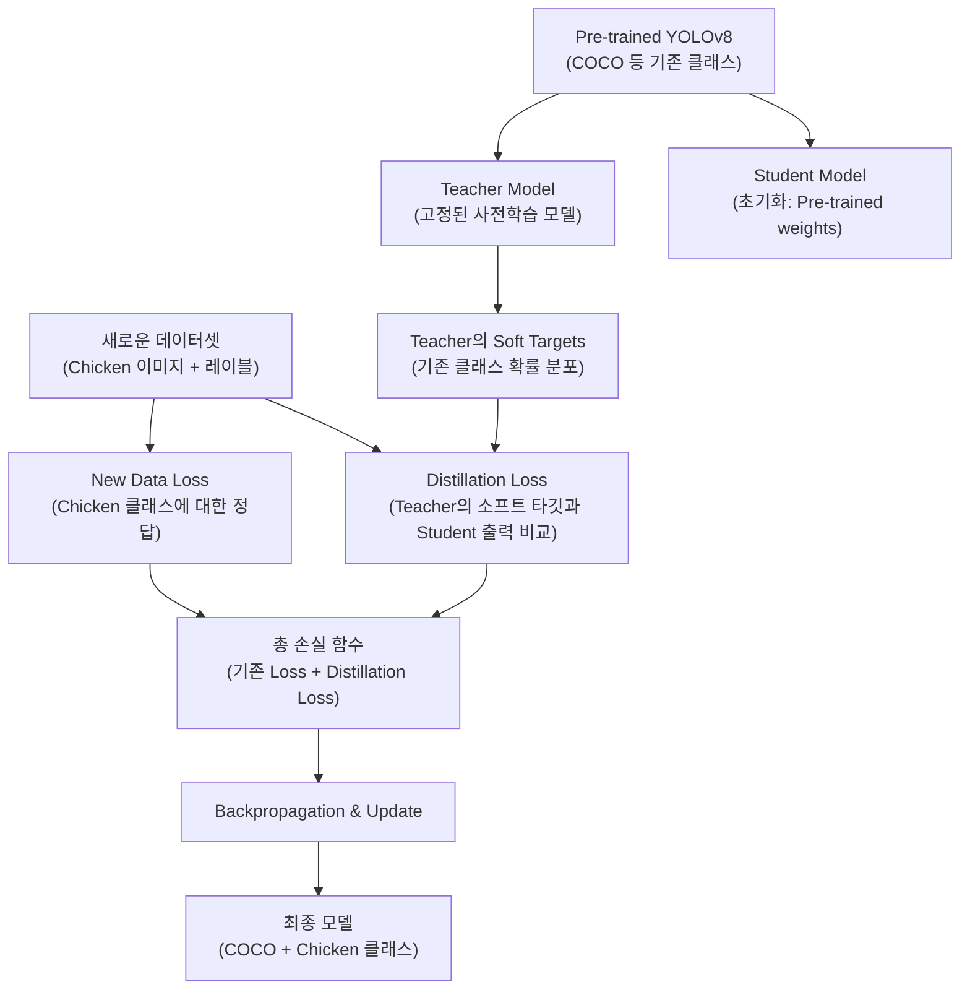

```mermaid
flowchart TD
    A["Pre-trained YOLOv8<br>(COCO 등 기존 클래스)"] 
    B["Teacher Model<br>(고정된 사전학습 모델)"]
    C["Student Model<br>(초기화: Pre-trained weights)"]
    D["새로운 데이터셋<br>(Chicken 이미지 + 레이블)"]
    E["Teacher의 Soft Targets<br>(기존 클래스 확률 분포)"]
    F["New Data Loss<br>(Chicken 클래스에 대한 정답)"]
    G["Distillation Loss<br>(Teacher의 소프트 타깃과 Student 출력 비교)"]
    H["총 손실 함수<br>(기존 Loss + Distillation Loss)"]
    I["Backpropagation & Update"]
    J["최종 모델<br>(COCO + Chicken 클래스)"]
    
    A --> B
    A --> C
    D --> F
    D --> G
    B --> E
    E --> G
    F --> H
    G --> H
    H --> I
    I --> J
```