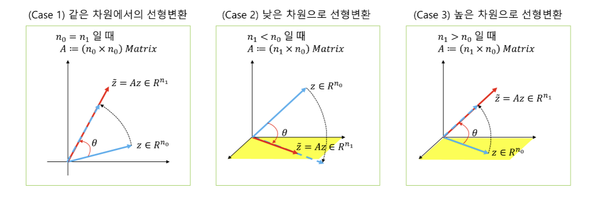
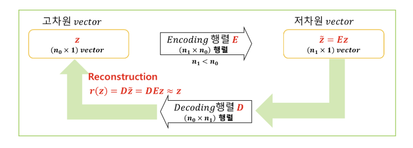

# **Matrix 곱을 이용한 차원변환, Encoding, Decoding 정리**

## **1. Matrix 곱의 의미**

- **Matrix 곱을 이용하여 차원을 변화시킬 수 있음**  
  $(n_1 \times n_0)$ 크기의 Matrix $A$를 이용하여 $(n_0 \times 1)$ 차원의 벡터 $z$에 곱(선형변환)하면  
  $(n_1 \times 1)$ 차원의 벡터 $\tilde{z}$를 얻을 수 있음

 $$\underset{(n_1 \times 1)}{\tilde{z}} = \underset{(n_1 \times n_0)}{A} \ \underset{(n_0 \times 1)}{z}$$
  

- **Matrix 곱은 다음과 같은 선형변환임**  
  어떤 벡터 $z$에 Matrix $A$를 곱한다(=선형변환 한다)는 것은,  
  1. 벡터 $z$를 $\theta$만큼 회전하고  
  2. 벡터 $z$의 크기를 $\alpha$배 하여  
  $\tilde{z}$로 만드는 변환이라고 볼 수 있음

> *동일 차원, 낮은 차원, 높은 차원으로의 선형변환*

## **2. Matrix곱을 이용한 Encoding과 Decoding**

### **2.1 Encoding과 Decoding의 개념**

- **Encoder-Decoder** 구조는 **Input Data**를 특정 형태(또는 차원)로 변환한 후, 다시 원래 형태나 차원으로 복원(Reconstruction)하는 과정을 의미함.

- 예를 들어, 고차원 벡터 $z \in \mathbb{R}^{n_0}$를 차원축소하는 Matrix $E$를 곱하여 저차원 벡터 $Ez$를 만들고, 그 저차원 벡터 $\tilde{z} (= Ez)$에 Matrix $D$를 곱하여 다시 고차원으로 확장(Decoding)하는 과정을 생각해 보자. 이때,

    $$r(z) = DEz$$

  가 원래의 고차원 벡터 $z$와 최대한 가깝도록(차이가 최소가 되도록) 하는 $E$와 $D$를 찾는 문제이다.

- $n_0 > n_1$인 경우,  
  - **Encoding**: 고차원 벡터 $z_{(n_0 \times 1)}$에 **Encoder Matrix** $E_{(n_1 \times n_0)}$를 곱하여 저차원 벡터 $\tilde{z}_{(n_1 \times 1)}$로 변환  
  - **Decoding**: 저차원 벡터 $\tilde{z} = Ez_{(n_1 \times 1)}$에 **Decoder Matrix** $D_{(n_0 \times n_1)}$를 곱하여 다시 고차원 벡터 $z_{(n_0 \times 1)}$로 복원  
  - **Reconstruction**:  

      $$r(z) = D(Ez)$$

    가 원래 z와 같아지거나(또는 차이가 최소화) 되도록 하는 과정

$$\underset{(n_0 \times 1)}{r(z)}=\underset{(n_0 \times n_1)}{D}\underset{(n_1 \times 1)}{\tilde z} = \underset{(n_0 \times n_1)}{D}\underset{(n_1 \times n_0)}{E}\underset{(n_0 \times 1)}{z}$$

$$
r(z) \approx z
$$

> 고차원 벡터 $z$ → 저차원 벡터 $\tilde{z}$ → reconstruction vector $r(z)$

### **2.2 Encoding과 Decoding 과정의 Optimization 문제**

- Encoder Matrix $E$와 Decoder Matrix $D$를 이용한 **Reconstruction** 과정을 **Optimization Problem**으로 표현하면 다음과 같음:

$$
\begin{align}
\underset{D, E}{\min} \quad & \left\| z - r(z) \right\|_2^2  \\
\text{subject to} \quad & \tilde{z} = Ez, \\
                        & r(z) = DEz.
\end{align}
$$

> $z$, $\tilde{z} = Ez$, $r(z) = DEz$ 관계도

## **3. 최적 Reconstruction을 찾기 위한 조건과 Reconstruction Loss**

> **문제**:  
> 어떤 Encoder Matrix $E$와 Decoder Matrix $D$가 주어졌을 때,  
> $r(z) = DE(z)$
> 가 원래의 $z$와 최대한 가깝게 되도록(또는 동일하도록) 만드는 방법을 알고 싶다.

### **3.1 3가지 제약 또는 가정**

1. $\mathbf{n_0 > n_1}$일 때, 간단히 차원확대(Decoding)가 가능하다고 가정
   $$r(z) = DEz,\quad \|z - r(z)\| < \epsilon$$

2. **Matrix $D$의 열 벡터들은 서로 직교(Orthogonal)**  
   $$D = [d_1, d_2, \ldots, d_{n_1}], \quad d_i \cdot d_j = 0 \ (i \neq j)$$

3. **Matrix $D$의 열 벡터들은 Unit Norm**  
   $$\|d_i\| = 1, \quad i = 1, \ldots, n_1$$

> **Note**: unit norm : 각 열 벡터의 길이(norm)가 1이라는 뜻
> ### Why? 열벡터의 길이를 1로 가정할까
> - **스케일 균일화:** 각 벡터의 크기를 동일하게 맞추어 학습 시 스케일 차이가 결과에 미치는 영향을 줄임
> - **안정된 학습:** 가중치의 값이 지나치게 커지거나 작아지는 것을 방지하여 학습을 안정화
> - **해석 용이성:** 각 열 벡터가 동일한 길이를 가지므로, 각 벡터의 방향(즉, 의미하는 feature나 basis vector)에 집중할 수 있음

### **3.2 Reconstruction Loss**

#### (1) 차원축소(Encoding) Matrix $E$와 차원확대(Decoding) Matrix $D$를 찾는 순서

1. **Decoding Matrix** $D$를 먼저 고려  
   $$r(z) = D\tilde{z}$$
2. 그 후, $D$를 이용해 **Encoding Matrix** $E$를 찾음  
3. 두 벡터 $r(z)$와 $z$ 간의 거리(예: $L_2$-norm의 제곱)를 최소화하는 $D$를 탐색색  
   $$L_2^2 = \|z - r(z)\|_2^2 = \|z - DEz\|_2^2$$

#### (2) 차원축소된 최적 벡터 $\tilde{z}^*$와 Reconstruction Loss

- $\tilde{z}^*$를 최적의 $\tilde{z}$ 라고 하면,  
  $$\tilde{z}^* = \arg\min_{\tilde{z}} \|z - D\tilde{z}\|_2^2$$

- $\|z - D\tilde{z}\|_2^2$를 전개하면,  
  $$\|z - D\tilde{z}\|_2^2 = (z - D\tilde{z})'(z - D\tilde{z}) \\ = z'z - 2z'D\tilde{z} + \tilde{z}'D'D\tilde{z}$$

- 가정 2. $D^T D = I$로 인해,  
  $$\tilde{z}' D' D \tilde{z} = \tilde{z}' \tilde{z}$$
- 따라서 최소화해야 할 목적함수는  
  $$z'z - 2z'D\tilde{z} + \tilde{z}'\tilde{z}$$
> $\tilde{z}$ 관련 항($- 2z'D\tilde{z} + \tilde{z}'\tilde{z}$)만 고려하면 된다($z'z$는 상수)

## **4. 최적 Encoding Matrix $E$ 찾기**

### **4.1 최적 Encoding Matrix $E$**

- 최소화 문제:  
  $$\min_{\tilde{z}} \Bigl(-2z'D\tilde{z} + \tilde{z}'\tilde{z}\Bigr)$$
- 최적 $\tilde{z}^*$는 위 식을 $\tilde{z}$로 편미분하여 0이 되는 점에서 얻어짐:

  $$\frac{\partial (-2 z'D\tilde{z} + \tilde{z}'\tilde{z})}{\partial \tilde{z}} = -2D'z + 2\tilde{z}^* = 0$$

  $$\Longrightarrow 
  \tilde{z}^* = D'z$$

- 따라서, **$D' = E$** (Encoder Matrix)임을 알 수 있음. 즉,
  $$\tilde{z} = E z = D' z$$
- 결과적으로
  $$r(z) = D(Ez) = DD' z$$

### **4.2 단순한 $D$ Matrix로 표현한 목적함수**

- $n_0 = 1$인 간단한 경우(즉 $D$가 $1 \times n_1$짜리 벡터 $d$라고 가정):
  $r(z) = dd'z.$
- 이를 모든 관측치에 대해 적용하면,
  $$d^* = \arg\min_{d} \sum_i \|z_i - dd'z_i\|_2^2$$
  단, $\|d\|_2 = 1$ (Unit Norm).
- 여러 관측치를 담은 $Z$ 행렬로 일반화:
  $$d^* = \arg\min_{d} \|Z - Zdd'\|_F^2,
  \quad
  \|d\|_2 = 1$$

### **[정리요약]**

- **Reconstruction Error를 최소화하는 문제**  
  $$\text{Original Problem: Reconstruction error Minimization}\\$$
  $$\quad \min_{d} \sum_i \|z_i - r(z_i)\|_2^2$$
  $$\quad \text{subject to } r(z) = DD'(z)$$
  $$\quad \|d\| = 1$$
  $$\text{Simple Reconstruction error Minimization Problem}$$
  $$\quad \min_{d} \sum_i \|z'_i - z'_i dd'\|_2^2$$
  $$\quad \text{subject to } \|d\| = 1$$
  $$\text{Trace로 표현한 Maximization Problem}$$
  $$\quad \max_{d} \ \mathrm{Tr}(Z'Z)$$
  $$\quad \text{subject to } \|d\| = 1$$

---

  \[
  \begin{align}
  & (\text{Original Problem: Reconstruction error Minimization}) \\
  & \quad \min_{d} \sum_i \|z_i - r(z_i)\|_2^2, \\
  & \quad \text{subject to } r(z) = DD'(z), \\
  & \quad \|d\| = 1. \\
  \\
  & (\text{Simple Reconstruction error Minimization Problem}) \\
  & \quad \min_{d} \sum_i \|z'_i - z'_i dd'\|_2^2, \\
  & \quad \text{subject to } \|d\| = 1. \\
  \\
  & (\text{Trace로 표현한 Maximization Problem}) \\
  & \quad \max_{d} \ \mathrm{Tr}(Z'Z), \\
  & \quad \text{subject to } \|d\| = 1. \\
  \end{align}
  \]
  ---

> **참고**: 위에서 설명한 과정은 기본적인 **선형 차원축소(Encoding)** 및 **복원(Decoding)** 개념을 설명하기 위한 간단한 예시이며, 실제 **Autoencoder**나 **PCA**와 같은 알고리즘은 추가적인 제약이나 비선형성, 규제항(Regularization) 등을 고려하여 최적화를 수행합니다.

