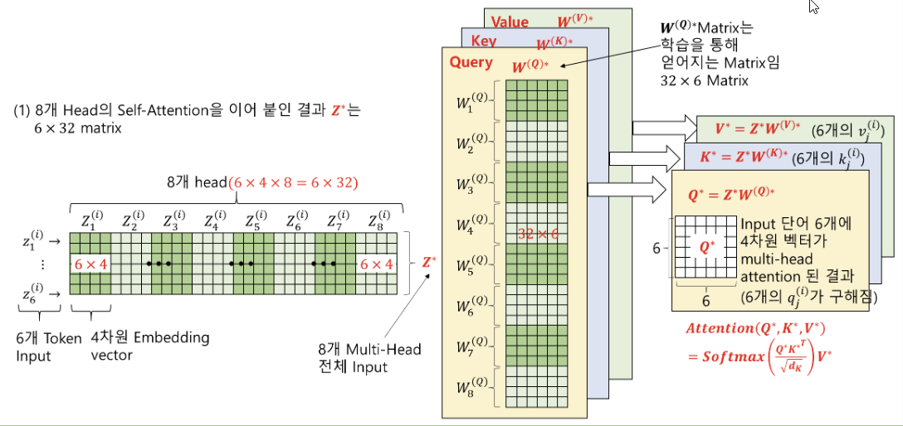
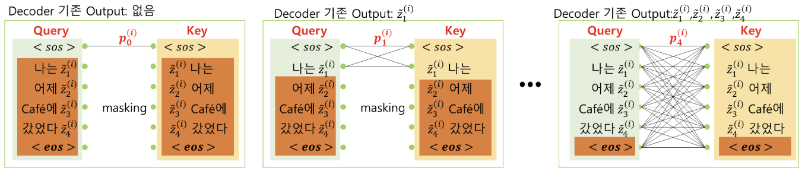

# Transformer - Attention 기반 자연어 처리

## 개요
- **Transformer**의 핵심은 **Attention** 메커니즘
- **Encoder** 구조를 활용하는 대표 모델: **BERT**  
- **Decoder** 구조를 활용하는 대표 모델: **GPT**  

## 3가지 Attention
1. **Self-Attention**  
   - 입력 시퀀스 내 단어들이 서로의 문맥적 관련성을 학습하기 위한 메커니즘임  
2. **Masked Self-Attention**  
   - 주로 **디코더**에서 사용하며, 미래 단어 정보를 참조하지 못하도록 마스킹함  
   - 텍스트 생성 시, 다음 단어 예측을 위해 과거 정보만 보게 함  
3. **Encoder-Decoder Attention**  
   - **인코더**의 출력(입력 문장 정보)과 **디코더**의 상태를 연결함  
   - 번역 등에서 입력 문장의 중요한 단어에 집중하도록 도움  

## 문맥의 중요성
- 단어는 문맥에 따라 여러 의미로 해석 가능함  
- 임베딩 시 **문맥 정보**를 반영해야 함  
- **Self-Attention**으로 문맥 정보를 고려해 단어 벡터를 동적으로 보정함  

## Self-Attention 계산 과정

0. **Query, Key, Value**:
   - 입력 벡터 $z_1^{(i)}$를 $W^{(Q)}, W^{(K)}, W^{(V)}$를 통해 Query, Key, Value로 분할함
1. **Attention Score**:  
   $$\alpha_1^{(i)} = q_1^{(i)} \cdot k_j^{(i)}$$ 
   - Query 벡터 $q_1^{(i)}$와 Key 벡터 $k_j^{(i)}$의 **내적**으로 유사도 계산함  
2. **Softmax**:  
   - $\alpha_1^{(i)}$를 Softmax에 통과시켜 확률 분포로 변환함  
3. **Attention Value**:  
   $$a_1^{(i)} = \sum_{j=1}^{n_e} v_j^{(i)} \cdot p_{1,j}^{(i)}$$
   - Value 벡터 $v_j^{(i)}$에 self-attention coefficient $p_{1,j}^{(i)}$를 곱해 가중 평균을 구함  
4. **Attention Vector**:  
   $$\hat{z}_1^{(i)} = \tanh \Bigl(W_1^{(s)(i)} \bigl(q_1^{(i)} + a_1^{(i)}\bigr)\Bigr)$$
   - $q_1^{(i)}$와 $a_1^{(i)}$를 더한 뒤(Concatenate), 매트릭스 $W_1^{(s)(i)}$로 **차원 축소**를 진행하고 $\tanh$ 적용함  
   - $a_1^{(i)}$는 쿼리 벡터 $q_1^{(i)}$를 문맥적으로 **보정**하는 역할을 함
   - 최종적으로 문맥을 반영한 $\hat{z}_1^{(i)}$를 생성

# Transformer 구조 상세

## 1. 입력 벡터 구성
- **입력 단어 임베딩**(Word Embedding) + **포지셔널 임베딩**(Positional Embedding) = **입력 벡터 $z$**  
- RNN을 사용하지 않으므로 토큰 순서 정보가 사라짐  
- 이를 보완하기 위해 **사인(sine), 코사인(cosine)** 등의 주기 함수를 사용해 위치 정보 concatenate

## 2. 멀티-헤드 어텐션(Multi-Head Self-Attention)
- 입력 벡터 $z$를 **Query, Key, Value**로 분할해 여러 개의 헤드로 어텐션을 수행
- 예: $z(6 \times 32)$에 $W(32 \times 6)$를 적용해, 똑같은 input vector를 곱해 문맥을 비교적 더 잘 반영한다고 볼 수 있음
- 여러 헤드에서 구한 결과를 **Concatenate**하여 최종 어텐션 출력을 생성

## 3. Skip-Connection과 네트워크 깊이
- **Skip-Connection**을 통해 입력과 출력 사이를 직접 연결해, **Gradient Vanishing** 문제를 완화
- Network를 더 **deep**하게 만들 수 있어, 복잡한 패턴 학습이 가능함  

## 4. Batch Normalization
- batch size 마다 평균, 표준편차가 달라질 수 있음  
- 이를 보정하기 위해 **학습 파라미터**(Scale, Shift 등)를 추가해 정규화  
- 배치 사이즈가 작으면 평균과 표준편차 추정에 편차가 생길 수 있어 주의 필요함  

## 5. Masked Multi-Head Self-Attention

- **디코더**에서 사용하는 **Self-Attention** 방식
- 미래 토큰(아직 번역되지 않은 토큰) 정보를 **Mask**하여, 현재 토큰을 예측할 때 미래 단어를 보지 못하도록 유도도
- 자연스러운 **시퀀스 생성**을 위해, 모델이 실제로 사용할 수 없는 정보를 학습하지 않도록 방지함  

## 6. [CLS] Token
- **임의의 무작위 벡터**로 초기화됨  
- 입력 시퀀스 전체의 의미를 대변하는 특별 토큰임  
- 모든 입력 토큰과 **유사도**(Attention)를 계산하며 문맥을 학습함  
- 최종적으로 **시퀀스 레벨**의 분류 등에 사용하기 위해, 별도의 Classifier가 붙음  

## 7. Transformer 인코더-디코더 구조 예시
- **인코더**: 입력 문장(word sequence)을 입력받아 문맥 정보를 추출  
  - Self-Attention, Feed Forward Network, Skip-Connection, Layer Normalization 등으로 구성
- **디코더**: 인코더 출력을 참고해 목표 문장(output sequence)을 생성
  - **Masked Self-Attention**으로 이미 생성된 토큰만을 활용  
  - **Encoder-Decoder Attention**으로 인코더에서 추출한 문맥 정보 활용  
  - 출력 확률 분포(Softmax)를 통해 단어를 생성함  

## 요약
- **Positional Encoding**으로 순서 정보를 보완
- **Multi-Head Self-Attention**으로 문맥 정보를 효과적으로 학습
- **Skip-Connection**, **배치 정규화** 등을 통해 안정적으로 깊은 네트워크 학습 가능
- **Masked Multi-Head Self-Attention**은 시퀀스 생성 시 미래 정보 사용을 차단
- **[CLS] 토큰**은 시퀀스 전체 의미를 담아 최종 분류나 회귀 등에 활용