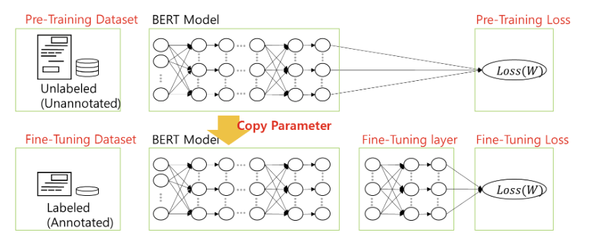
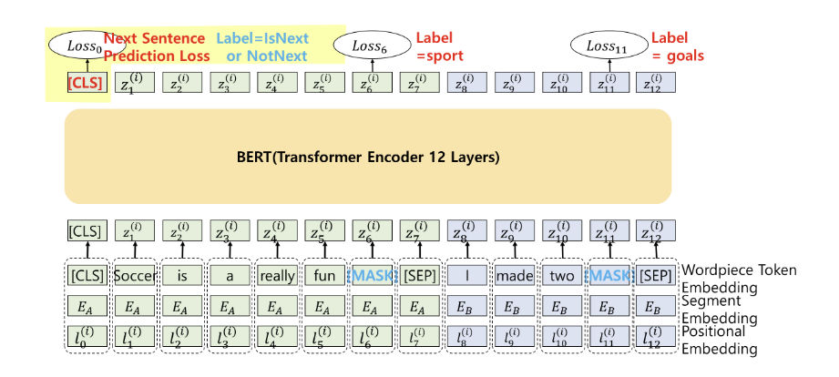

# BERT Overview

- **Transformer의 Encoder 활용:**  
  BERT는 Transformer의 encoder 부분만을 사용하여 설계됨.

- **Pre-Training with Unlabeled Data:**  
  unlabeled 데이터를 이용하여 language model로 pre-training 수행  
  - **Training Tasks:**  
    - **Masked Language Modeling (MLM):** 일부 단어를 [MASK]로 가리고 이를 예측하도록 학습  
    - **Next Sentence Prediction (NSP):** 두 문장이 연속되는 문장인지 아닌지 판단하여 문장 간의 관계성을 학습

- **Transfer Learning & Fine-Tuning:**  
  pre-training된 BERT 모델을 가져와 특정 NLP 문제 해결을 위해 추가 학습 (fine-tuning)  
  - fine-tuning 과정에서는 주어진 task에 맞게 모델을 최적화함

- **Multimodal 가능성:**  
  label이 없는 dataset을 train했기에 text 뿐만 아니라 image 처리도 가능하다는 점이 암시됨

- **언어 이해에 적합:**  
  BERT는 주로 언어 이해(understanding) task에 최적화되어 있으며, 번역(generation)과 같은 생성 작업에는 적합하지 않음

## 문제 해결 유형

1. **1개 문장 분류:**  
   - 예: spam mail 분류, 감성 분석 등
2. **2개 이상 문장의 관계 분류:**  
   - 예: 참/거짓 문장 관계 예측
3. **문장 내 단어의 label 예측:**  
   - 예: 개체명 인식(NER)
4. **QnA:**  
   - 질문과 문장을 받아 정답 예측

## BERT의 Sub-Word Tokenizer: WordPiece

- **Sub-Word 분할:**  
  - 단어를 더 작은 단위로 나누어 처리
- **유사점:**  
  - BPE(Byte Pair Encoding)과 유사한 방식으로 자주 함께 나타나는 글자들을 하나의 단위(Sub-word)로 합침
- **장점:**  
  - OOV(Out Of Vocabulary) 문제를 줄임 (미리 준비된 어휘에 없는 단어를 작은 단위로 나눠 처리 가능)

## Positional Encoding
- 단어의 순서 정보를 제공하기 위해 sin, cos 함수를 이용하여 각 단어별로 다른 값을 할당

## BERT의 Contextual Embedding 방법

BERT의 입력 토큰은 아래 3가지 embedding 값의 합으로 구성됨:

1. **Word Token Embedding:**
   - 각 문장을 WordPiece 방식으로 토큰화  
   - Special Tokens:  
     - **[CLS]:** 문장 시작 및 문장 요약 기능  
     - **[SEP]:** 두 문장을 구분하기 위한 토큰  
       - 구성 예시: `[CLS] - [첫 번째 문장의 토큰들] - [SEP] - [두 번째 문장의 토큰들]`

2. **Segment Embedding:**
   - 각 토큰이 어느 문장에 속하는지를 구분

3. **Positional Embedding:**
   - 입력 토큰의 위치 정보를 제공

### BERT의 Special Token

- **[CLS]:**  
  - 문장의 시작을 지정하며, 문장 요약에 활용됨

- **[SEP]:**  
  - 문장 구분에 사용

- **[MASK]:**  
  - Pre-Training 시 일부 단어를 가리고 예측하게 하는 데 사용

- **[UNK]:**  
  - 알 수 없는 단어에 대한 토큰

- **[PAD]:**  
  - 입력 길이를 맞추기 위해 사용

## BERT의 학습 방법

### i) Pre-Training

- **데이터:**  
  - unlabeled dataset 사용

- **학습 과정:**

  1. **Masked Language Modeling (Loss_MLM):**  
     - 일부 단어를 가리고 남은 토큰으로 가린 토큰을 예측하도록 학습  
     - 모델이 양방향 문맥 정보를 활용하여 학습

  2. **Next Sentence Prediction (Loss_NSP):**  
     - 입력되는 두 문장이 연속되는 문장인지, 아니면 다른 문장인지를 맞추도록 학습  
     - 문장 간의 관계와 논리적 연결성 이해를 도모

  3. **Multi-Head Self-Attention:**  
     - 두 가지 학습 목적(Loss_MLM + Loss_NSP)을 동시에 최적화

### ii) Fine-Tuning

- **단계:**

  1. **Model 준비:**  
     - pre-training된 BERT 모델 로드
  2. **Data 준비:**  
     - 특정 NLP 문제에 맞는 데이터셋 준비
  3. **Training 과정:**  
     - fine-tuning을 위한 학습 진행
  4. **Optimization:**  
     - 학습 과정 중 최적화 수행
  5. **평가 및 개선:**  
     - 모델 성능 평가 및 필요시 개선 작업 진행
