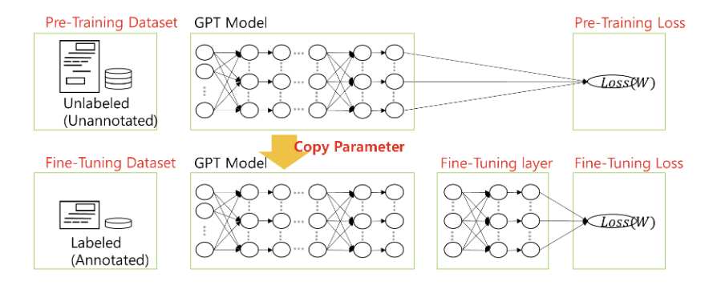
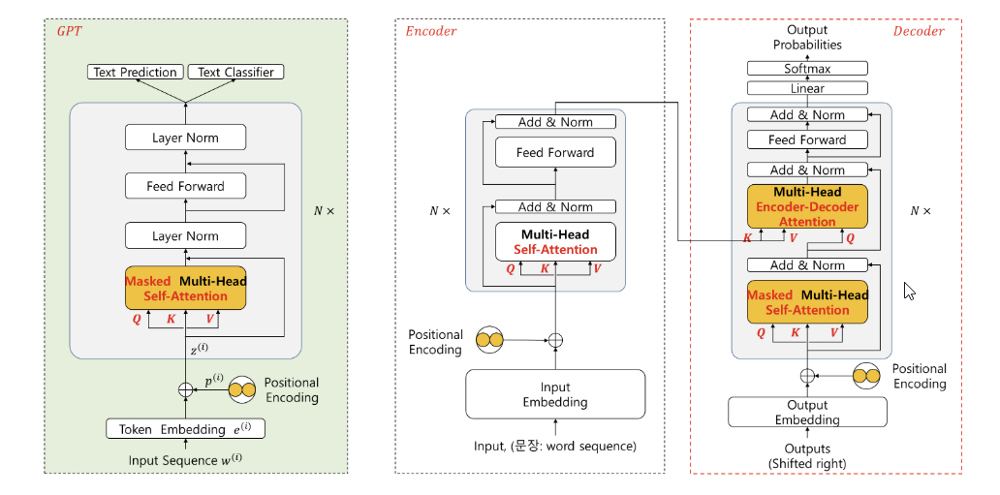

# GPT Overview

- **Transformer의 Decoder 기반:**

  GPT는 Transformer의 decoder 아키텍처를 기반으로 설계됨.

- **Masked-Head Self-Attention:**  
  기존의 Encoder-Decoder Attention 대신, Masked-Head Self-Attention을 반복 사용하여 다음 토큰 예측을 수행함.

- **LLM의 등장:**  
  GPT-3.0부터 본격적인 대규모 언어 모델(LLM)이 등장함.

- **Few-Shot Learning:**  
  - **Zero-shot Learning:**  
    사전학습된 정보만을 활용하여 task 수행  
  - **One-shot Learning:**  
    사전학습된 정보와 추가적인 한 개의 예시 제공  
  - **Few-shot Learning:**  
    사전학습된 정보와 여러 개의 예시(prompt)를 통해 특정 작업 수행 가능  
- **In-Context Learning:**  
    - 사용자가 prompt를 제공하면 모델이 텍스트를 분석하여 관련 output을 생성

- **RLHF & PPO:**  
  - GPT-3.5부터는 강화학습(PPO: Proximal Policy Optimization)을 활용하여 사용자 의도, 편향성, 환각(hallucination) 문제를 개선  
  - 강화학습을 통해 모델 파라미터를 fine-tuning함

- **Fine-Tuning:**  
  특정 문제에 맞게 모델을 추가 학습하여 성능을 개선할 수 있음

## GPT Model Training

1. **Data 수집:**  
   다양한 데이터 소스를 통해 학습 데이터 수집

2. **Tokenization & Embedding:**  
   데이터를 토큰화하고 임베딩을 수행하여 모델 입력으로 변환

3. **LLM 학습:**  
   Masked-Head Self-Attention을 반복 적용하며 대규모 언어 모델 학습

4. **RLHF (Reinforcement Learning from Human Feedback):**  
   - 사용자의 피드백을 반영하여 모델 개선  
   - PPO(Procimal Policy Optimization)를 사용하여 모델 파라미터를 fine-tuning

5. **Text Generation:**  
   최종적으로 학습된 모델을 사용하여 텍스트 생성 수행
