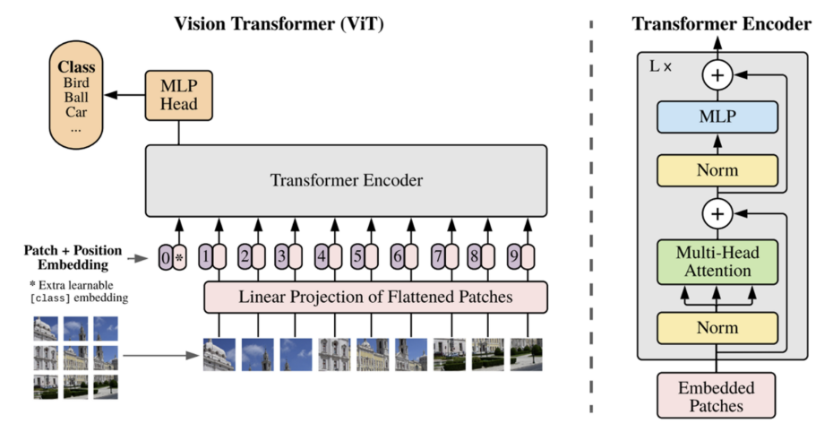

# Vision Transformer (ViT)

## 1. 개념
- **Transformer의 Encoder 구조**를 이용해 이미지를 처리하는 모델
- 이미지를 **작은 패치(patch)**로 나누어 각각을 **토큰(token)**으로 취급
- 패치 임베딩 + **Positional Embedding** → Transformer Encoder에 입력

## 2. 특징
- **Self-Attention**을 통해 **전역적(Context-wide) 관계**를 학습
- CNN 대비 **로컬 패턴**에 대한 사전 가정이 적음 (Inductive Bias가 낮음)
- 대규모 데이터 사용 시 **높은 성능** 발휘 가능

## 3. 구조
1. **Patch Embedding**  
   - 이미지를 일정 크기로 잘라 Flatten 후 선형 투영 (Linear Projection)
2. **Positional Embedding**  
   - 각 패치의 위치 정보를 추가로 학습
3. **Transformer Encoder**  
   - **Multi-Head Self-Attention** + **Feed-Forward Network**를 여러 번 반복
   - [CLS] 토큰으로 전체 이미지를 대표하는 임베딩 추출
4. **MLP Head**  
   - [CLS] 임베딩을 입력받아 최종 **분류** 등 Downstream Task 수행

## 4. 장단점
- **장점**  
  - 전역적 문맥 정보 학습에 강점  
  - 대규모 데이터에서 높은 성능  
- **단점**  
  - 작은 데이터셋에서 학습 시 성능 저하  
  - 계산량 및 자원 요구도가 높음
