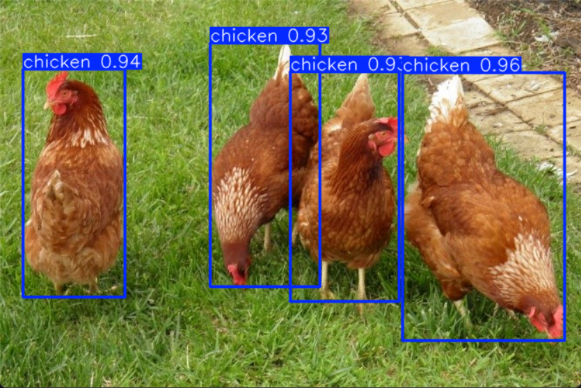
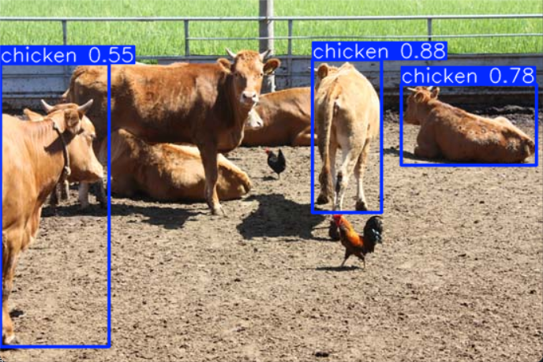

## 현재 진행 상황
- yolov8s 모델에는 'chicken'이라는 레이블이 없어서 닭을 'bird'로 인식
- fine-tuning으로 'chicken'레이블을 만들어 학습을 시켰지만?
- 모델이 **모든 object를 'chicken'으로 분류**함.

## 문제 상황
- 기존 pre-trained 모델(yolov8s)은 다양한 클래스(COCO 데이터셋 등)에서 학습되었기 때문에, 이를 그대로 fine-tuning 하면 보통은 새로운 레이블만 추가하는 게 아니라, **전체 클래스에 대해 재학습**하는 효과가 나타남.
- 만약 오직 "chicken"만 포함한 데이터로 학습을 진행하면, 모델은 **모든 객체를 "chicken"으로 인식**하도록 학습됨.
- 다른 객체도 올바르게 구분하고 싶다면 fine-tuning 과정에서 'chicken'뿐만 아니라 **다른 모든 레이블에 대한 데이터와 라벨**이 포함된 데이터셋을 사용해 모델을 학습시켜야함.